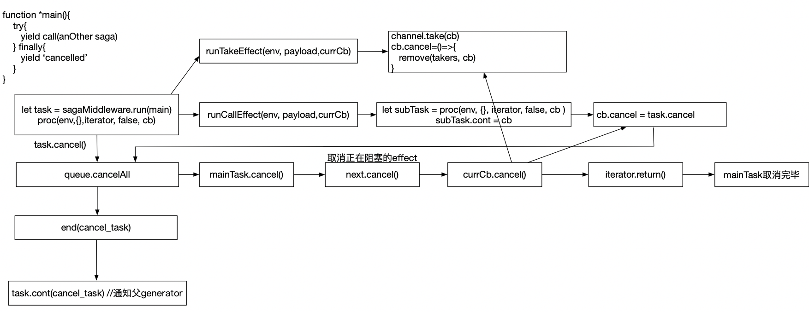

#### Task的取消逻辑

取消task要取消本task，取消掉当前阻塞task的effect，以及本task下的子task

执行`task.cancel()`来取消一个task。接着程序会去调用`queue.cancelAll()`方法来取消task下fork产生的task和mainTask,取消方法也是执行每个task的cancel方法。

最底层最终调用的都是`mainTask.cancel()`方法来取消任务。`mainTask.cancel()`会将cancel信号作为参数去调用`next`方法，`next`方法收到取消信号后会去执行`next.cancel()`方法来取消正在阻塞的effect。

当前正在阻塞的effect会给`currCb`设置一个cancel方法，这个cancel方法可以用来取消自己。`next.cancel()`中会调用`currCb.cancel()`来取消正在阻塞的effect。

`next.cancel()`方法执行完毕后，会执行`iterator.return()`方法，这会使的状态机跳到`finally`区块（假如有的话）并执行区块里的代码。这个时候mainTask取消完毕，接下来去执行`task.end()`方法，`end`方法会去告诉父task（假如有的话）“我已经结束了”（通过`task.cont()`方法），并把取消信息作为参数放入父task的next方法中执行。

至此，task取消完毕。

